# Sending Messages To The Device Broker Examples
## Table of contents
- [Table of Contents](#table-of-contents)
- [Create an Api Key for netFIELD Data Service](#create-an-api-key-for-netfield-data-service)
- [Retrieve MQTT credentials for netFIELD Data Service from netFIELD.io](#retrieve-mqtt-credentials-for-netfield-data-service-from-netfieldio)
- [Retrieve credentials for netFIELD Data Service from netFIELD-API](#retrieve-mqtt-credentials-for-netfield-data-service-from-netfield-api)
- [Connect to netFIELD Data Service with MQTT Explorer](#connect-to-netfield-data-service-with-mqtt-explorer)
  - [Connect using MQTT over Websocket](#connect-using-mqtt-over-websocket)
  - [Connect using MQTT Secure (MQTTS)](#connect-using-mqtt-secure-mqtts)
- [Configure a Device](#configure-a-device)
- [Topics](#topics)
  - [netFIELD App Platform Connector - subscribe to messages sent to device](#netfield-app-platform-connector---subscribe-to-messages-sent-to-device)
- [Examples](#examples)
  - [General information](#basics)
  - [C#](#c)
  - [Javascript](#javascript)
  - [Python](#Python)
- [Troubleshooting](#troubleshooting)

## Create an Api Key for netFIELD Data Service 

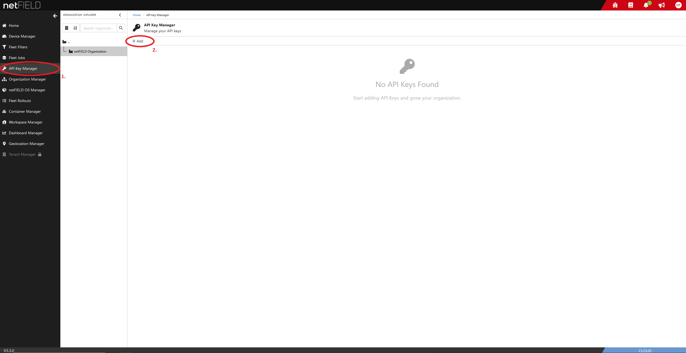 

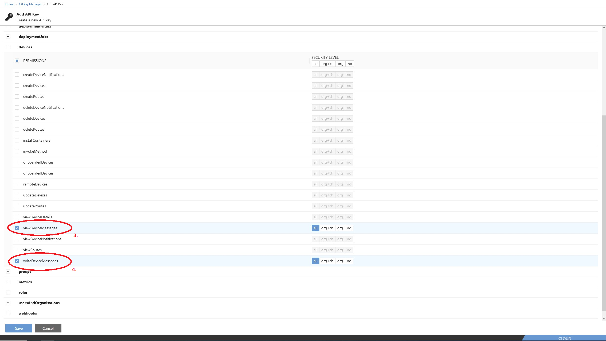 

## Retrieve MQTT credentials for netFIELD Data Service from netFIELD.io

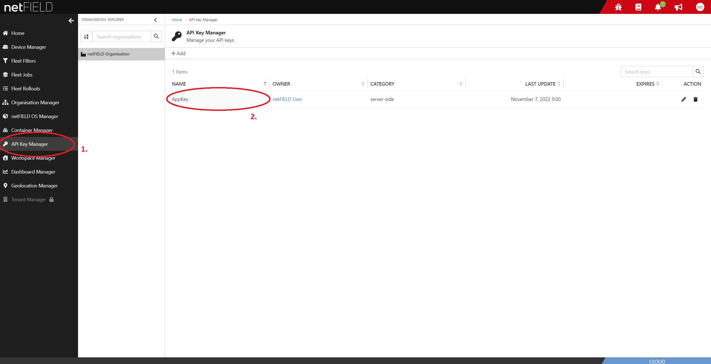 

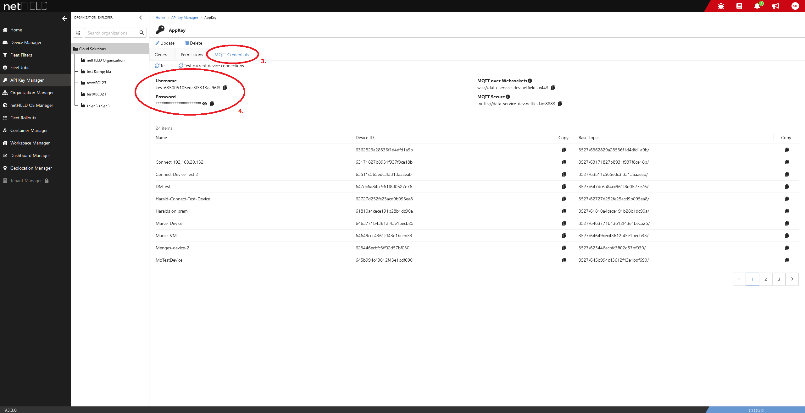 

## Retrieve MQTT credentials for netFIELD Data Service from netFIELD-API

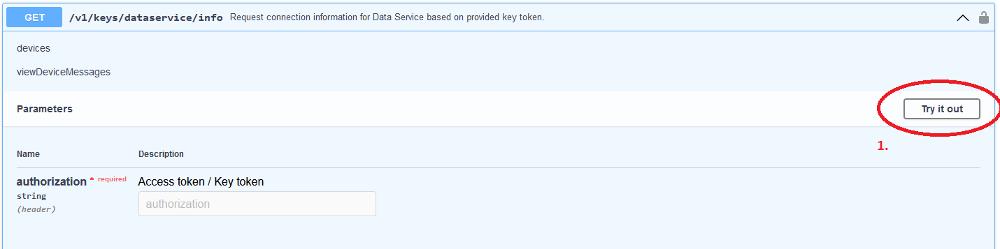 

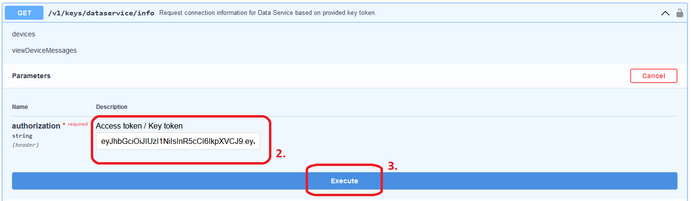 

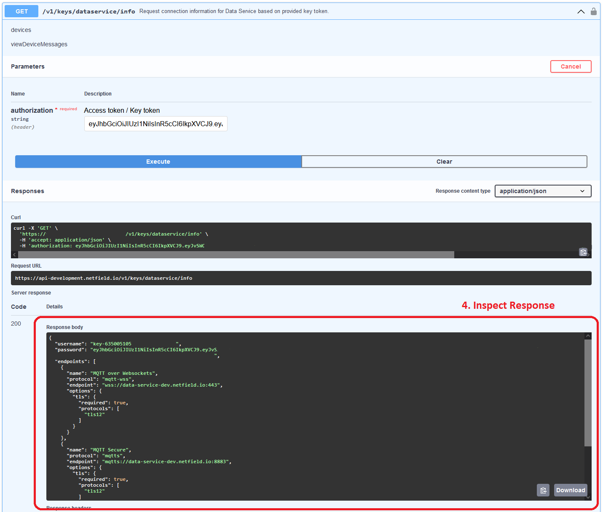 

## Connect to netFIELD Data Service with MQTT Explorer
[MQTT Explorer](http://mqtt-explorer.com/) is a freely available MQTT client to connect to and work with MQTT brokers. The following guide helps to setup a connection to netFIELD Data Service with this tool.

### Connect using MQTT over Websocket
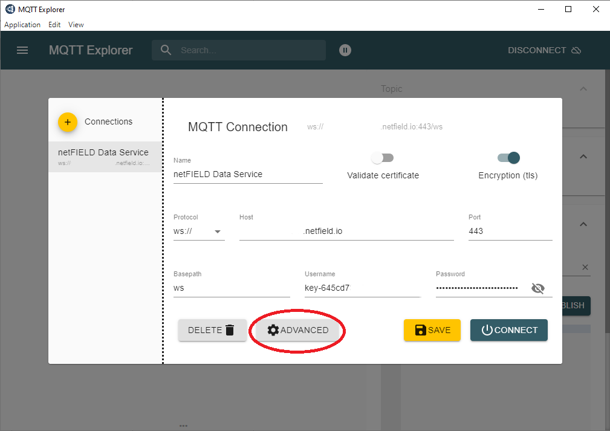 

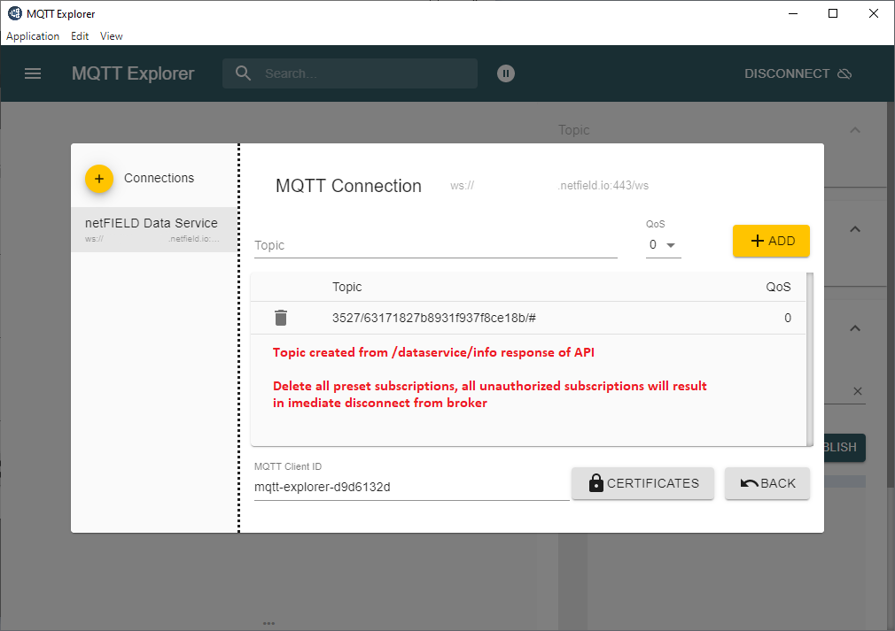 

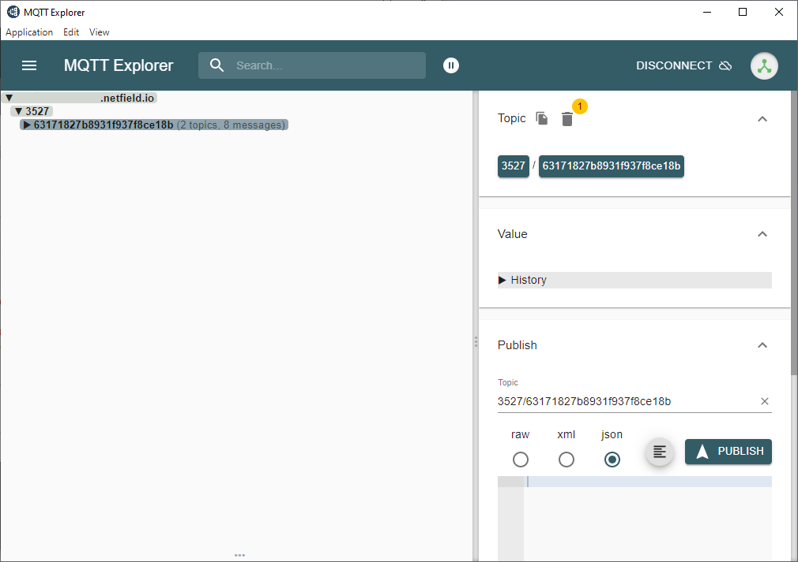 

### Connect using MQTT Secure (MQTTS)
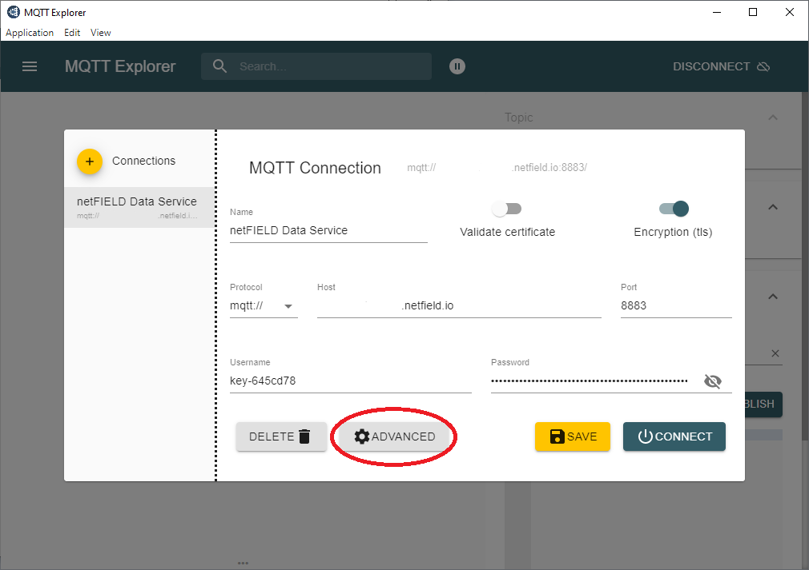 

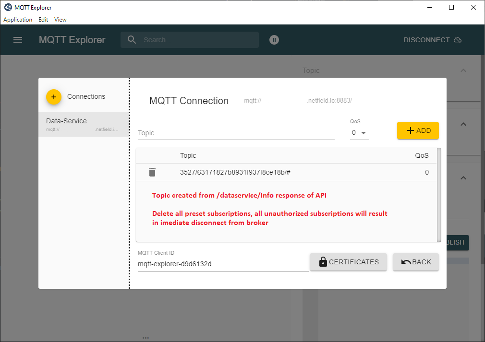 

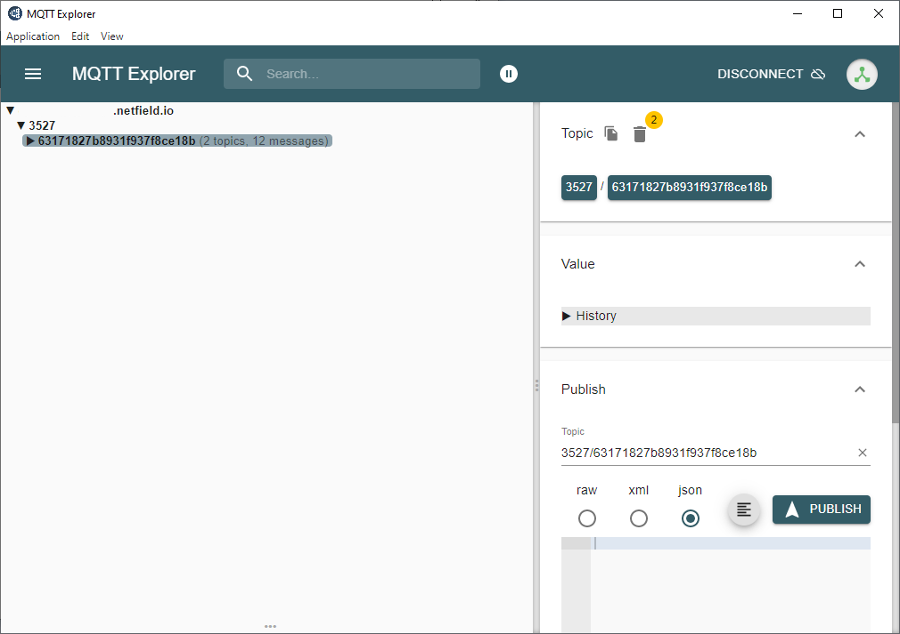 

## Configure a Device
To configure a device to send data via netFIELD Platform Connector reference to manual `netFIELD App Platform Connector`.

## Topics
To subscribe to messages of a specific device, a combination of `baseTopic` and a device topic must be used. Reference to image below. The `baseTopic` can be fetched from netFIELD-API (View examples or swagger of API).

The following diagram represents the workflow and structure of topics inside the netFIELD-Data-Service system.

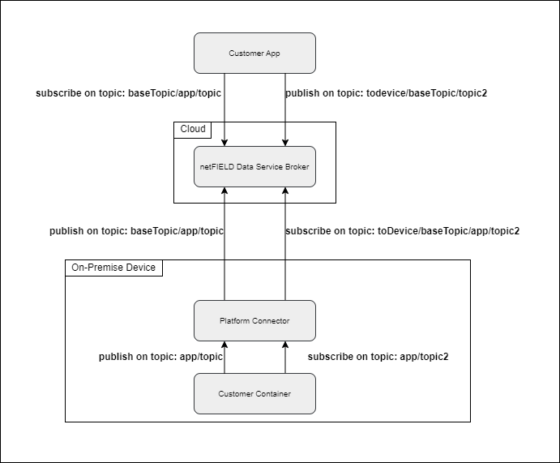

To subscribe to a topic and start receiving its messages, you can do that from the netFIELD platform or locally on the device using the netFIELD App Platform Connector.

### netFIELD App Platform Connector - subscribe to messages sent to device

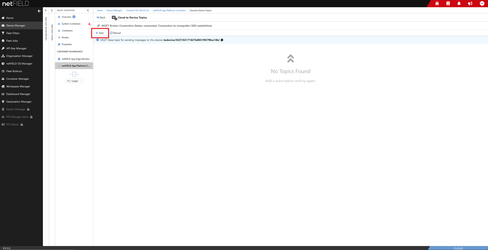

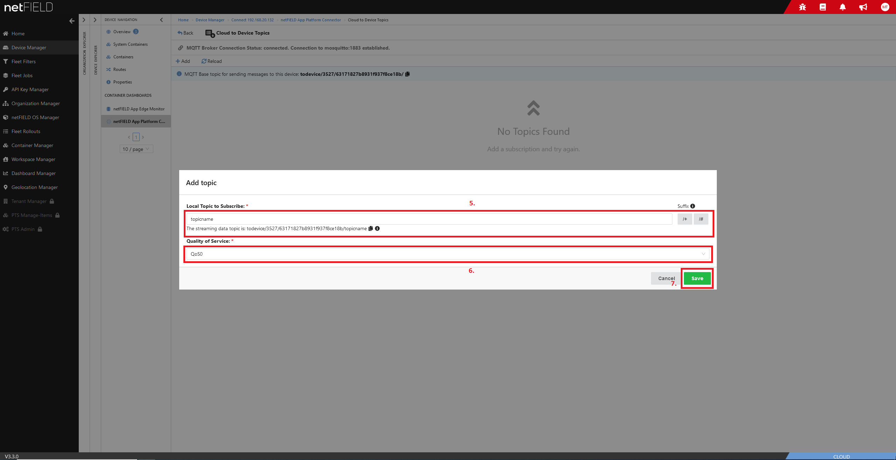

## Examples
### General information
Provided examples perform the following steps:
1. Perform a GET request to `/keys/dataservice/info` of netFIELD API. Payload is an empty JSON object. A header with `authorization: APIKEY` and an ApiKey with permission `devices: viewDeviceMessages` (to be able to subscribe and receive messages) and `devices: writeDeviceMessages` (to be able to publish messages). Those permissions can be set in netfield.io.

2. The response is parsed. Received information contains an endpoint as well as username and password to connect to MQTT broker of netFIELD-Data-Service.

3. A connection to MQTT broker is established using endpoint, username and password from `/keys/dataservic/info` response. TLS must be used. Two protocols are supported:
    * MQTTS: MQTT Secure using port 8883.
    * MQTT-WSS: MQTT over Websocket using port 443.

4. Devices base topic is looked up in `/keys/dataservice/devices` response and is combined with `#` wildcard to subscribe all messages of this device.

5. Subscription to previously calculated topic is performed and messages are received.

6. Publish a message to a provided topic with the special prefix `todevice/` to signal that the message is published from cloud to the device.

The following sequence diagrm illustrates performed interactions:

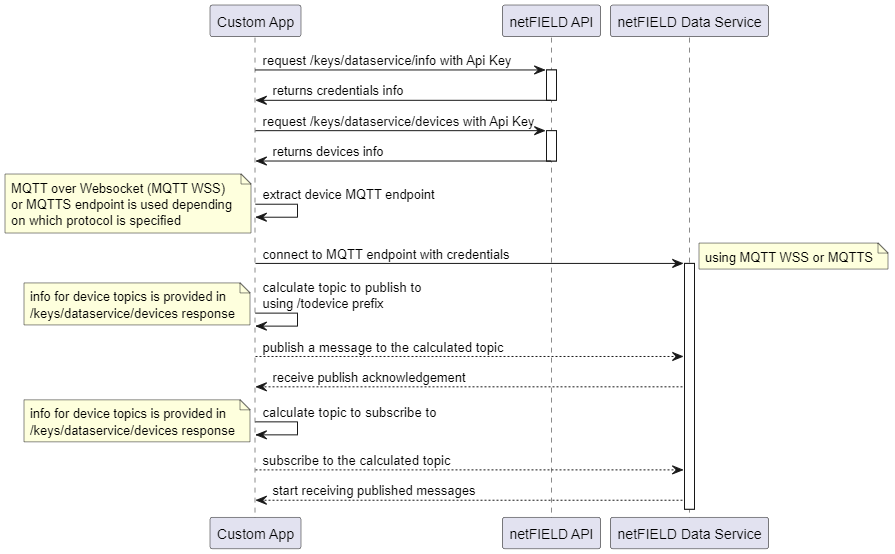

### C#
The example performs a request to netFIELD-API, connects via MQTT websocket or MQTTS to netFIELD-Data-Service then subscribe and publish messages to a device.
[MQTTnet](https://github.com/dotnet/MQTTnet) is used as library to connect via MQTT.

### Javascript
Request to netFIELD-API is made using [node-fetch](https://github.com/node-fetch/node-fetch) and a connection to netFIELD-Data-Service broker is performed to subscribe and publish messages to a device using [MQTT.js](https://github.com/mqttjs/MQTT.js).

### Python
Using the HTTP library [request](https://pypi.org/project/requests/) a request is made to netFIELD-API and a connection to netFIELD-Data-Service broker is performed to subscribe and publish messages to a device using Eclipse Paho client library for MQTT Broker connection.
https://www.eclipse.org/paho/index.php?page=clients/python/index.php

## Troubleshooting

> Receiving status code 404 from api.

Verify api endpoint url is correct. Access `/dataservice/connectioninfo`.

> Receiving status code 401 from api.

Used Key has no permission to access this information. Verify used key has `viewDeviceMessages`. Verify there is no typo in submitted key.

> MQTT client disconnects (imediately).

Multiple possible issues: 
- Subscriptions are performed, that are not permitted.
- TLS is not used.
- Publishes to the broker are performed that are not permitted.
