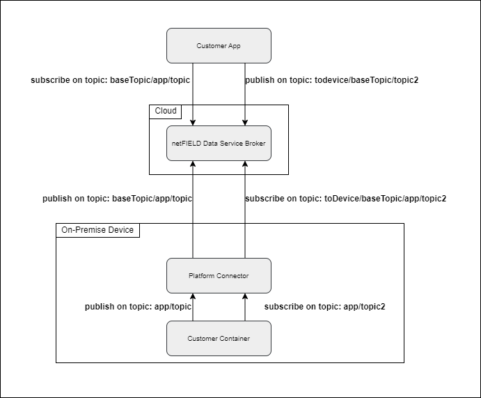
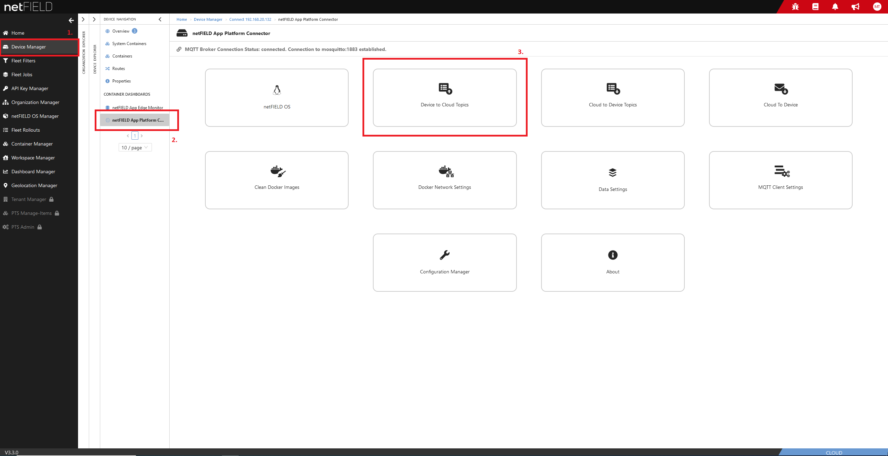
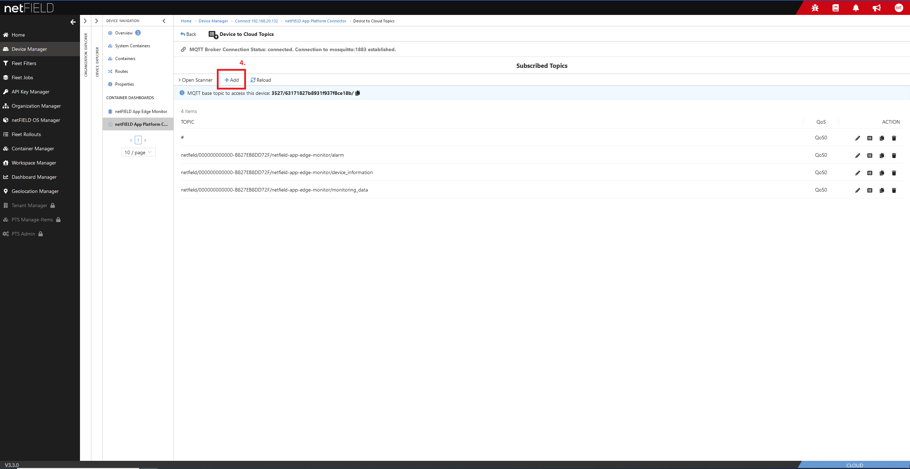
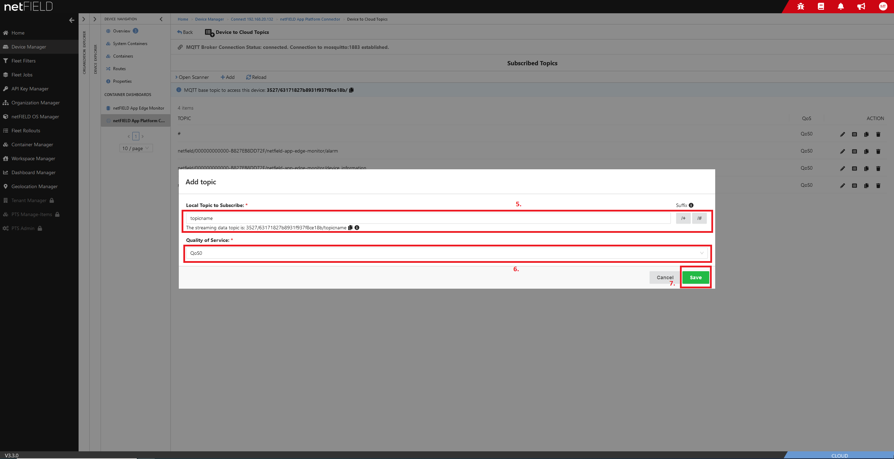
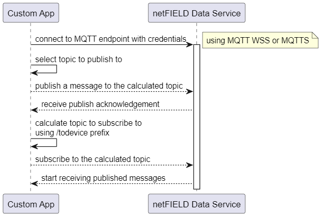

# Managing MQTT subscriptions Examples
## Table of contents
- [Table of Contents](#table-of-contents)
- [Topics](#topics)
  - [netFIELD App Platform Connector - subscribe to receive messages from device](#netfield-app-platform-connector---subscribe-to-receive-messages-from-device)
- [Subscribe to topic in netFIELD App Platform Connector](#connect-to-netfield-data-service-with-mqtt-explorer)
- [Examples](#examples)
  - [General information](#basics)
  - [C#](#c)
  - [Javascript](#javascript)
  - [Python](#Python)
- [Troubleshooting](#troubleshooting)

## Topics
To subscribe to messages of a specific device, a combination of `baseTopic` and a device topic must be used. Reference to image below. The `baseTopic` can be fetched from netFIELD-API (View examples or swagger of API).

The following diagram represents the workflow and structure of topics inside the netFIELD-Data-Service system.

To subscribe to a topic and start receiving its messages, you can do that from the netFIELD platform or locally on the device using the netFIELD App Platform Connector.

### netFIELD App Platform Connector - subscribe to receive messages from device

## Examples
### General information
Provided examples connect to the device local MQTT broker, subscribe a topic to receive its messages, and publish a user message on a topic.

The following sequence diagrm illustrates performed interactions:

### C#
[MQTTnet](https://github.com/dotnet/MQTTnet) is used as library to connect to a broker via MQTT to receive and publish messages.

### Javascript
[MQTT.js](https://github.com/mqttjs/MQTT.js) is used to connect to broker to receive and publish messages.

### Python
Eclipse Paho client library for MQTT Broker connection to receive and publish messages.
https://www.eclipse.org/paho/index.php?page=clients/python/index.php

## Troubleshooting

> MQTT client disconnects (imediately).

Multiple possible issues: 
- Subscriptions are performed, that are not permitted.
- TLS is not used.
- Publishes to the broker are performed that are not permitted.
